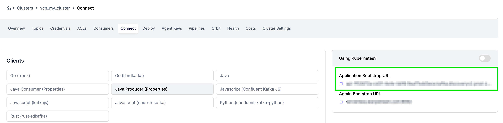

# WarpStream TableFlow Guide

### What is WarpStream TableFlow?
Tableflow automates the tedious process of transforming a topic in an Apache Kafka-compatible data streaming system into an Apache Iceberg table. Instead of writing custom code and manually configuring a data pipeline for each table you want to build, Tableflow allows you to declaratively specify which topics to build tables from and what schema and data format to expect. When schemas inevitably need to change, you can update the schema in Tableflow's editor and WarpStream will handle the schema migration automatically.

Compaction and table maintenance is included out-of-the-box with no tuning required. Tableflow continuously compacts the table in the background with intelligent heuristics to ensure readers get the best performance.

To learn more about Tableflow on Warpstream, read *[The Case for an Iceberg-Native Database: Why Spark Jobs and Zero-Copy Kafka Won’t Cut It](https://www.warpstream.com/blog/the-case-for-an-iceberg-native-database-why-spark-jobs-and-zero-copy-kafka-wont-cut-it)*


>Tableflow is current available as an Early Access (EA) feature. Please [contact Warpstream](https://www.warpstream.com/contact-us) if you'd like to register to be included in the Early Access program.

### Prerequisites
1. Docker
    - For macOS:
        ```bash
        # Install Homebrew if you haven't already
        /bin/bash -c "$(curl -fsSL https://raw.githubusercontent.com/Homebrew/install/HEAD/install.sh)"

        # Install Docker Desktop
        brew install --cask docker
        ```
    - Launch Docker Desktop after installation
    - Verify installation:
        ```bash
        docker --version
        ```

2. AWS Credentials

- Configure your AWS credentials in ~/.aws/credentials
- Ensure you have access to an S3 bucket in the credentials with IAM permissions to write.

3. WarpStream Account

- Sign up at [WarpStream](https://console.warpstream.com/signup)
- [Open Warpstream Console](https://console.warpstream.com/) once signed up and signed in.
- Create Warpstream Cluster
Here, we are creating a Kafka-compatible Warpstream cluster that uses object storage to persist data that you can interact with using the Kafka protocol. 
    - Navigate to Clusters
    - **Create Kafka Cluster**
    - **Cluster Tier**: `Dev`
    - **Give cluster a name**: `my_ws_cluster`
    - **Deployment Model**: `BYOC`
    - **Region**: `us-east-1`
    - **+ Create Cluster**

    

- Create Tableflow Cluster
    - Navigate to Tableflow
    - **Create Tableflow**
    - **Cluster Tier**: Dev
    - **Give Tableflow a name**: `my_tableflow_cluster`
    - **Control Plane Region**: `us-east-1`
    - **+ Create Tableflow**

    

### Agent Keys
- Obtain your agent keys and virtual cluster IDs
- Keys can be found under the Agent Keys section of the Warpstream Console for each respective service

- Keep in mind, you need an Agent key for your Warpstream Cluster and Tableflow both.

    

- Click to reveal the Kafka cluster Agent Key and copy it to `AGENT_KEY` in `set-your-variables-here.sh`
- Navigate to your Tableflow cluster Agent Key and copy it to `TFLOW_AGENT_KEY` in `set-your-variables-here.sh`


### Setup Instructions
1. Configure Environment Variables

Edit [`set-your-variables-here.sh`](set-your-variables-here.sh) with your WarpStream and AWS details:
```bash
export S3_BUCKET=s3://your-s3-bucket-name
export S3_BUCKET_REGION=your-aws-region
export AGENT_KEY=your-warpstream-agent-key
export TFLOW_AGENT_KEY=your-tableflow-agent-key
export KAFKA_VIRTUAL_CLUSTER_ID=your-warpstream-cluster-id
export CLUSTER_REGION=your-cluster-region
export TF_VIRTUAL_CLUSTER_ID=your-tableflow-cluster-id
```

- For S3 Bucket, provide the full s3 url: `s3://your-s3-bucket-name`.
- Provide the S3 Bucket region
- We obtained the Agent keys in the previous section
- For Virtual Cluster ID, navigate to your Warpstream Kafka Cluster Main Page and copy the Cluster ID from the table.
- For cluster region, we set `us-east-1` so you can set that in your variables
- For `WARPSTREAM_DEFAULT_VIRTUAL_CLUSTER_ID`, set your Tableflow Cluster ID obtained the same way as with the Kafka virtual cluster ID.


2. Configure Tableflow 
- Navigate to the Configuration page of Tableflow in the UI
- Add in the following for your pipeline and deploy:

```bash
source_clusters:
  - name: "byoc_kafka"
    bootstrap_brokers:
      - hostname: "warpstream-agent"
        port: 9092
tables:
  - source_cluster_name: byoc_kafka
    source_topic: customers
    source_format: json
    schema_mode: inline
    schema:
      fields:
        - { name: customerId, type: string, id: 1 }
        - { name: name, type: string, id: 2 }
        - { name: zone, type: string, id: 3 }
        - { name: address, type: string, id: 4 }
        - { name: membership, type: string, id: 5 }
  - source_cluster_name: byoc_kafka
    source_topic: orders
    source_format: json
    schema_mode: inline
    schema:
      fields:
        - {name: orderId, type: string, id: 1 }
        - { name: customerId, type: string, id: 2 }
        - { name: orderDate, type: string, id: 3}
        - { name: cost, type: float, id: 4}
        - { name: creditCardNumber, type: string, id: 5}
destination_bucket_url: <<bucket-name>>
```
- `hostname` should be bootstrap url without port, can be found under Clusters > Connect tab.


- Make sure to fill in your destination bucket url as `<<bucket-name>>` with your bucket.
- Click Save and Deploy

3. Start WarpStream Services

```bash
# Run the WarpStream setup script
./run-warpstream.sh
```
This will:

- Create a Docker network for WarpStream services
- Start the WarpStream agent
- Initialize the TableFlow service

3. Configure Shadow Traffic

- Supply and create your `license.env` file for ShadowTraffic in the root of this project.
  - You can obtain a ShadowTraffic License for generating data [here](https://shadowtraffic.io/pricing.html).

- Review and customize [customers-orders.json](customers-orders.json) for your data simulation needs. This file defines the structure and patterns of your synthetic data.

- Start Shadow Traffic Simulation

```bash
# Run the shadow traffic generator
./run-shadowtraffic.sh
```

Monitoring and Management
- WarpStream agent is accessible on port 9092
- TableFlow service runs on port 9093
- Monitor Docker containers:

```bash
docker ps
docker logs warpstream-agent
docker logs warpstream-tableflow
```

Shutting Down
- When you're done testing:

```bash
./tear-down-warpstream.sh
```


Troubleshooting
1. Docker Network Issues

- Ensure Docker is running
- Check if the network exists: docker network ls
- Recreate network if needed: docker network create warpstream-net
- Ensure no other processes are taking up the ports 9092 or 9093.

2. Connection Issues
- Verify AWS credentials are properly configured
- Ensure S3 bucket is accessible
- Check agent keys and cluster IDs are correct

3. Shadow Traffic Not Working
- Verify license.env file exists and is properly configured
- Check customers-orders.json format
- Review Docker logs for any error messages


### Additional Resources
[WarpStream Documentation](https://docs.warpstream.com/warpstream/)

[TableFlow Documentation](https://docs.warpstream.com/warpstream/tableflow/tableflow)

[Shadow Traffic Documentation](https://docs.shadowtraffic.io/)
